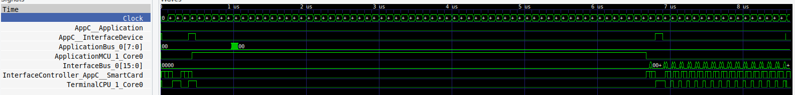
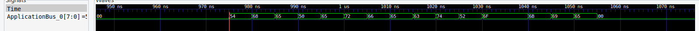
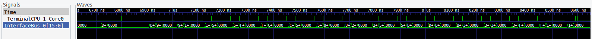

A little nice rookie challenge dealing with waveforms of digital transactions...

# The challenge

For this rookie challenge, we are given a VCD (Value Change Dump) file containing the wave of a transaction between a host and a smartcard.
The challenge hints tell us that the card will first send an AES key on the Application Bus, then a message on the Interface Bus.

# The wave

We can open the wave with a VCD viewer - gtkwave for instance. We get the following:



And yes, there is some activity on the Application Bus at the beginning of the wave, and some activity on the Interface Bus at the end of the wave.

# The key

Zooming of the first part of the wave, we get a 16 bytes sequence on the application bus. Very likely our key.



We can either manually copy it since it is only 16 bytes long, or grep for busApplicationBus_0 in the vcd file for the corresponding binary values and convert in hex. In both cases we end up with a 128 bits key: 0x54686550657266656374526f6f6b6965 which reads "ThePerfectRookie" in ASCII.

# The message

Let's have a look at the last part of the wave containing the message on the interface bus.



The interface bus is a 16 bits bus. Transactions seem qualified by the AppC__SmartCard or TerminalCPU_1_Core0 signals - so we take only the data occurring when TerminalCPU_1_Core0 signal is a logical 1. Here again, either manual copy or grep in the VCD file, filter a bit for zero and duplicate values, and convert in hex.

Our message reads: 0xd24e901e1f505570f727c6ce5d9183bd296c52afdffab4a83af73a53fa551c01

# Putting it all together

We just have to decrypt the message with the key, using AES. A few lines of python will do the trick:

```
#!/usr/bin/env python3

from Crypto.Cipher import AES

key = bytes.fromhex("54686550657266656374526f6f6b6965")
msg = bytes.fromhex("d24e901e1f505570f727c6ce5d9183bd296c52afdffab4a83af73a53fa551c01")
cipher = AES.new(key, AES.MODE_ECB)
print(key, cipher.decrypt(msg))
```

And we get our flag !
